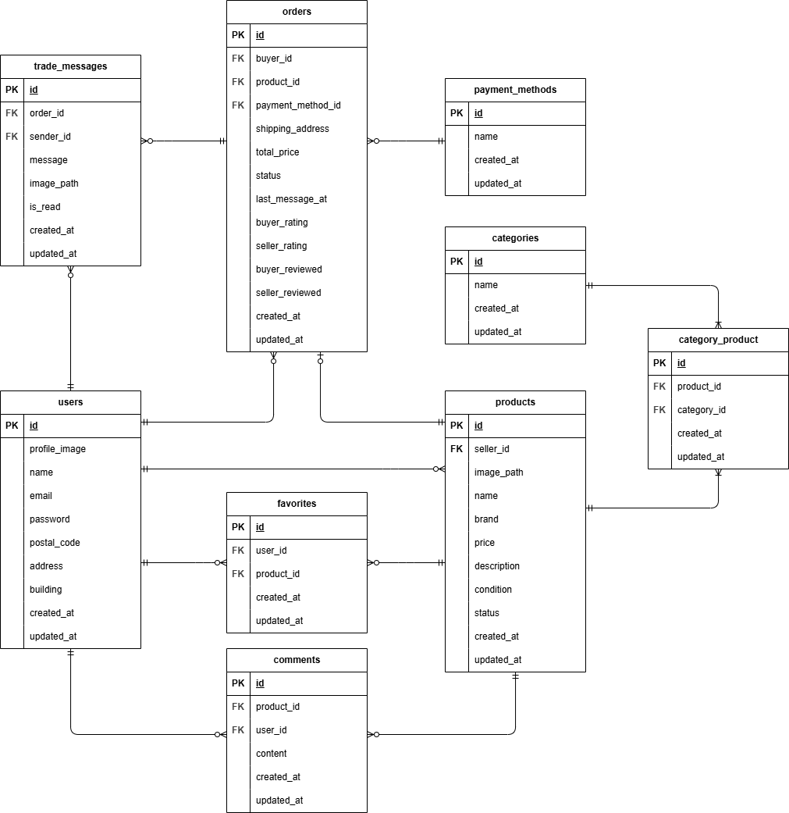

# アプリケーション名

coachtechフリマ（Pro課題版）

本アプリケーションはCOACHTECH模擬案件1（フリマアプリ）に対して、Pro入会試験の追加要件を実装したものです。
模擬案件1の基本機能に加えて、メッセージ機能／評価機能などを追加しています。

## 使用技術（実行環境）

- PHP 8.x
- Laravel 8.x
- MySQL 8.x
- Nginx
- Docker / docker-compose

## 環境構築

### 0. リポジトリのクローン

```bash
git clone <リポジトリURL>
cd プロジェクト名
```

### 1. Docker コンテナのビルド・起動

```bash
docker compose up -d --build
```

### 2. PHP コンテナに入ってセットアップ

```bash
docker compose exec php bash

# 依存関係
composer install

# .env 作成 & APP_KEY 生成
cp .env.example .env
php artisan key:generate
```

※`.env.example` はセキュリティのためキーを空にしてあります。 自分の環境でキーを作って設定してください。

### 3. マイグレーション & シーディング実行

```bash
# php コンテナ内で実行
php artisan migrate --seed
```

### 4. ストレージリンク作成（画像表示用）

サンプル画像を`storage/app/public/products/`に含めています。
初回は以下のコマンドでシンボリックリンクを作成してください。

```bash
php artisan storage:link
```

## ER 図



## URL

- 開発環境：http://localhost/

## ログインアカウント（ダミーユーザー3名）

### ① 購入専用ユーザー（出品なし）

- **name**: 購入専用ユーザー
- **email**: buyer@example.com
- **password**: password

### ② 出品者ユーザー1（CO01〜CO05を出品）

- **name**: 出品者A
- **email**: seller1@example.com
- **password**: password

### ③ 出品者ユーザー2（CO06〜CO10を出品）

- **name**: 出品者B
- **email**: seller2@example.com
- **password**: password

## Pro課題で追加した機能

このリポジトリでは、模擬案件1のフリマアプリに対して、次の機能を追加しています。

1. **取引メッセージ機能**
    - 購入者と出品者が、取引ごとのチャット画面でメッセージを送受信できます。
    - テキストに加えて画像も添付できます。

2. **取引の相互評価機能**
    - 取引完了後、購入者・出品者がお互いを星 1〜5 で評価できます。
    - ユーザーのプロフィール画面で平均評価を表示します。

3. **取引完了メール通知**
    - 購入者が取引を完了すると、出品者に通知メールを送信します（MailHog で確認可能）。

## メール送信の確認方法

本プロジェクトでは MailHog を使用しています。
`docker compose up -d` で MailHog コンテナも起動します。  
ブラウザで http://localhost:8025 にアクセスするとメールを確認できます。`.env.example` は MailHog 用に設定済みです。

```env
MAIL_CLIENT_URL=http://localhost:8025
```

## Stripe決済について

本アプリではStripeを利用して決済を行います。
動作確認にはStripeの**テスト用APIキー**が必要です。

1. Stripeのアカウントを作成してください
2. ダッシュボードの**API キー**から以下を取得してください
    - 公開可能キー（例: pk_test_xxx）
    - シークレットキー（例: sk_test_xxx）
3. `.env` に設定してください（`.env.example` をコピーして編集）
    ```env
    STRIPE_KEY=pk_test_xxx
    STRIPE_SECRET=sk_test_xxx
    ```
4. テストカード番号で決済確認できます。以下のテストカード番号をご利用ください。

- カード番号: 4242 4242 4242 4242
- 有効期限: 任意の未来日
- CVC: 任意の3桁（例：123）
- カード名義: 任意の名前
